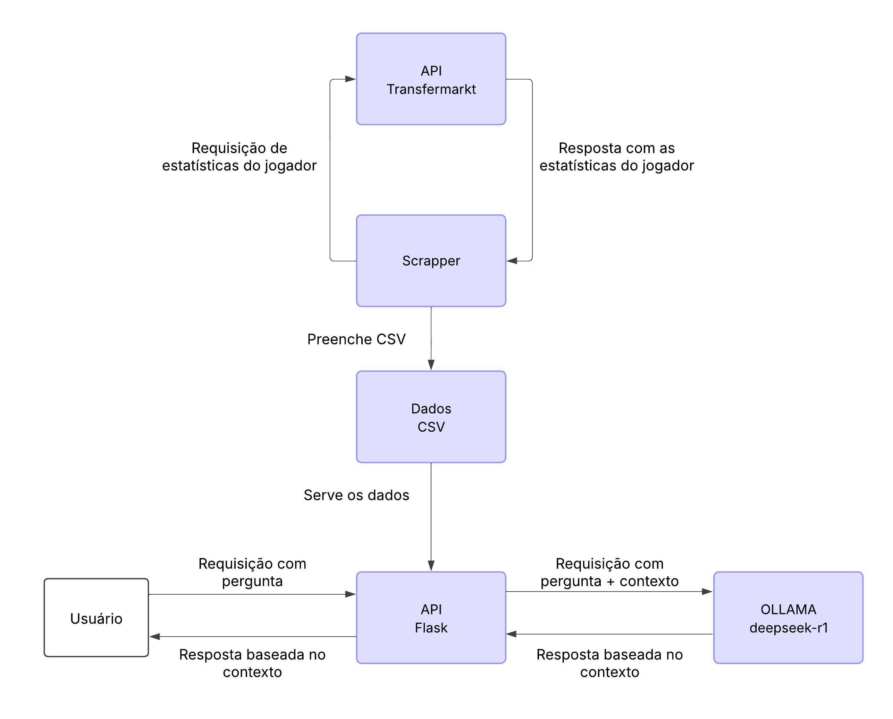

# Raspagem de Dados do Transfermarkt e Integração com IA

## Descrição do Projeto
Este projeto foi desenvolvido como parte do curso de Sistemas Distribuídos e tem como objetivo realizar a raspagem de informações do site Transfermarkt. Os dados coletados são armazenados em arquivos CSV e posteriormente utilizados por um modelo de Inteligência Artificial (IA) baseado no Ollama com DeepSeek. Esse modelo responde às perguntas dos usuários com base nas informações coletadas.

## Estrutura do Projeto
```
api_scrapper/
|-- lib.py  # Biblioteca auxiliar para raspagem de dados
|-- main.py  # Script principal da raspagem

data/
|-- (Diretório para armazenar os arquivos CSV gerados)

docs/
|-- data-flow.png  # Fluxograma do funcionamento do sistema
|-- Relatório de Impacto à Proteção de Dados Pessoais.pdf  # Documentação relacionada à LGPD

main.py  # API Flask para servir os dados e integrar com a IA
requirements.txt  # Lista de dependências do projeto
```

## Fluxo de Funcionamento
1. A API do Transfermarkt é consultada para obter estatísticas de jogadores.
2. O scraper coleta essas informações e as salva em arquivos CSV.
3. A API Flask serve esses dados e os utiliza como contexto para responder perguntas dos usuários.
4. A IA Ollama (com DeepSeek) processa as perguntas e fornece respostas baseadas nas estatísticas armazenadas.



## Tecnologias Utilizadas
- **Python** (raspagem de dados e API)
- **Flask** (API para interação com os dados)
- **Ollama com DeepSeek** (modelo de IA para responder perguntas)
- **Pandas** (manipulação de dados CSV)
- **Requests** (requisições HTTP para coleta de dados)

## Instalação e Execução
### 1. Clonar o Repositório
```sh
git clone <URL_DO_REPOSITORIO>
cd <NOME_DO_REPOSITORIO>
```

### 2. Instalar as Dependências
```sh
pip install -r requirements.txt
```

### 3. Executar o Scraper
```sh
python api_scrapper/main.py
```

### 4. Iniciar a API Flask
```sh
python main.py
```

### 5. Fazer Requisições para a API
A API responde a perguntas dos usuários com base nos dados armazenados. Um exemplo de chamada:
```sh
curl -X POST "http://localhost:5000/pergunta" -H "Content-Type: application/json" -d '{"pergunta": "Quantos gols Gabriel Barbosa marcou na última temporada?"}'
```